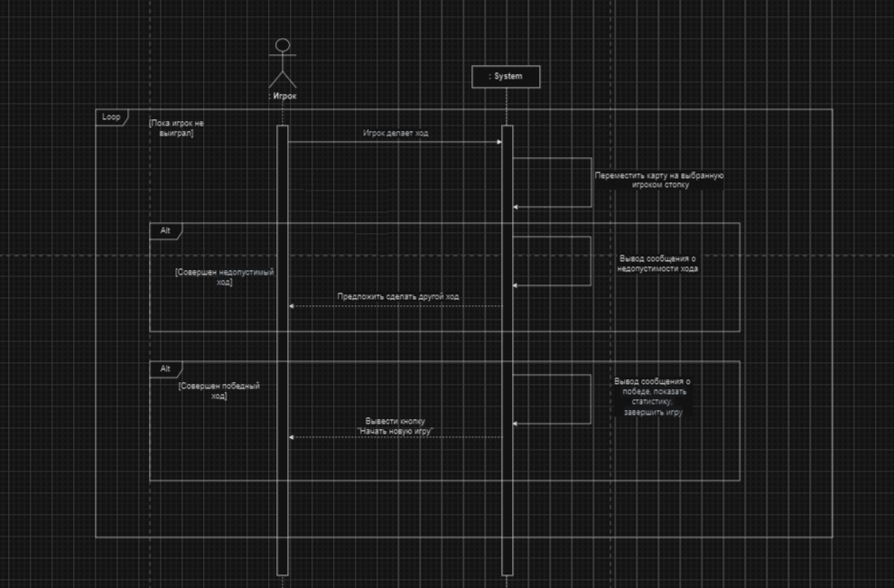
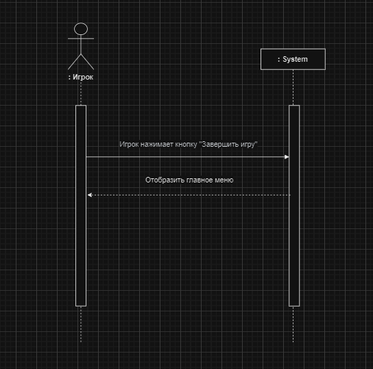

# Создание системных диаграмм последовательностей
## Прецедент "Войти в игру"
<html>
  <head>
  </head>
<body style="background-color: white;">
[]!(./images/lab3/login.png#gh-dark-mode-only)
</body>
|Действие|Нажать кнопку "Войти в игру"|
| :- | :- |
|Ссылки|Прецедент “Войти в игру”|
|Предусловия|Игра запущена|
|Постусловия|Игрок зашел в игру|
|||
|Действие|Отобразить главное меню|
|Ссылки|Прецедент “Войти в игру”|
|Предусловия|Игрок зашел в игру|
|Постусловия|Главное меню отображено|
|||
|Действие|Запросить имя|
|Ссылки|Прецедент “Войти в игру”|
|Предусловия|Главное меню отображено|
|Постусловия|Появилось поле для ввода имени|
|||
|||
|Действие|Ввести имя|
|Ссылки|Прецедент “Войти в игру”|
|Предусловия|Появилось поле для ввода имени|
|Постусловия|Имя игрока введено|
|||
|||
|Действие|Сохранить игрока|
|Ссылки|Прецедент “Войти в игру”|
|Предусловия|Имя игрока введено|
|Постусловия|Имя игрока сохранено|

## Прецедент "Начать игру"

|Действие|Нажать кнопку "Начать новую игру"|
| :- | :- |
|Ссылки|Прецедент “Начать игру”|
|Предусловия|Имя игрока сохранено|
|Постусловия|Начата новая игра|
|||
|||
|Действие|Подготовка нового игрового поля с новым набором карт.|
|Ссылки|Прецедент “Начать игру”|
|Предусловия|Начата новая игра|
|Постусловия|Подготовлено игровое поле с новым набором карт.|
|||
|Действие|Отображения игрового поля и карт|
|Ссылки|Прецедент “Начать игру”|
|Предусловия|Подготовлено игровое поле с новым набором карт.|
|Постусловия|Отображено игровое поле и карты|
|||
|||
|Действие|Нажать кнопку "Вернуться назад"|
|Ссылки|Прецедент “Начать игру”|
|Предусловия|Игрок нажал кнопку "Вернуться назад"|
|Постусловия|Подготовка к возврату в меню|
|||
|Действие|Сохранение данных и сброс. |
|Ссылки|Прецедент “Начать игру”|
|Предусловия|Подготовка к возврату в меню|
|Постусловия|Данные сохранены и выполнено завершение текущей игры.|
|||
|||
|Действие|Вернуться в главное меню|
|Ссылки|Прецедент “Начать игру”|
|Предусловия|Данные сохранены и выполнено завершение текущей игры.|
|Постусловия|На экране игрока отображено главное меню|

## Прецедент "Сделать ход"

|Действие|Игрок делает ход|
| :- | :- |
|Ссылки|Прецедент “Сделать ход”|
|Предусловия|Отображено игровое поле и карты|
|Постусловия|Записаны данные хода|
|||
|||
|Действие|Переместить карту на выбранную  игроком стопку|
|Ссылки|Прецедент “Сделать ход”|
|Предусловия|Записаны данные хода|
|Постусловия|Карта перемещена|
|||
|Действие|Вывод сообщения о  недопустимости хода |
|Ссылки|Прецедент “Сделать ход”|
|Предусловия|Игрок сделал недопустимый ход|
|Постусловия|Вывелось сообщение "Недопустимый ход"|
|||
|||
|Действие|Предложить сделать другой ход|
|Ссылки|Прецедент “Сделать ход”|
|Предусловия|Вывелось сообщение "Недопустимый ход"|
|Постусловия|Игрок может сделать другой ход|
|||
|Действие|Вывод сообщения о   победе, показать статистику,  завершить игру|
|Ссылки|Прецедент “Сделать ход”|
|Предусловия|Игрок совершил победный ход|
|Постусловия|Выведено сообщения о   победе, статистике,   и завершение игры|
|||
|||
|Действие|Вывести кнопку "Начать новую игру"|
|Ссылки|Прецедент “Сделать ход”|
|Предусловия|Выведено сообщения о   победе, статистике,   и завершение игры|
|Постусловия|Выведена кнопка "Начать новую игру"|

## Прецедент "Завершить игру"

|Действие|Вывести кнопку "Завершить игру"|
| :- | :- |
|Ссылки|Прецедент “Завершить игру”|
|Предусловия|Определена победа|
|Постусловия|Выведена кнопку "Завершить игру"|
|||
|||
|Действие|Игрок нажимает кнопку "Завершить игру"|
|Ссылки|Прецедент “Завершить игру”|
|Предусловия|Выведена кнопку "Завершить игру"|
|Постусловия|Нажата кнопка "Завершить игру"|
|||
|Действие|Отобразить главное меню|
|Ссылки|Прецедент “Завершить игру”|
|Предусловия|Нажата кнопка "Завершить игру"|
|Постусловия|Главное меню отображено|

</html>
